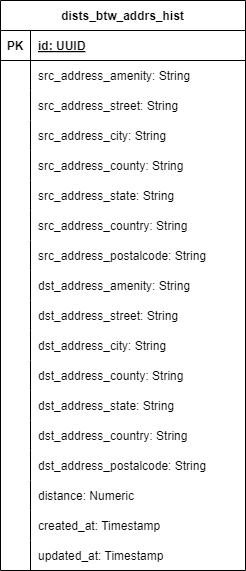

# Hi there!

Be very welcome to my solution to my resolution to Bain Take-Home Assignment.

- [Introduction](#introduction)
- [How to run the Project?](#how-to-run-the-project)
- [Backend Application](#backend-application)
- [Frontend Application](#frontend-application)
- [Final Considerations](#final-considerations)

## Introduction

This project consists in a full-stack application composed by a frontend and a backend application that can be run using Docker containers.

- The frontend application is a simple interface where two addresses can be entered: source and destination. When sending this data, the application should display a message with the distance in kilometers between these two addresses.

- The backend application is a REST API developed using Node.js/TypeScript and Postgres database that provides two API endpoints: one to calculate the distance between two addresses and another to retrieve the history of distance calculations between two addresses using a paging scheme, where records are organized in descending order of creation time in the database.

## How to run the project?

All applications and database can be run using a [**Docker**](https://www.docker.com/) container with commands from a Makefile file.

### Makefile file

A **Makefile** file was created as a single entry point containing a set of instructions to run all applications (backend and frontend) and the database using Docker containers via commands in the terminal.

To run the project with a Docker container, run the command:

```
make startup-all
```

Note:

- If you don't have the dependencies needed to run instructions from a Makefile file, just copy and paste and run the Docker command related to the instruction above to run the project.

To finish all applications and database, run the command:

```
make shutdown-all
```

## Frontend Application

After running the project, access the following URL through your web browser to view an HTML page that illustrates the frontend application:

```
http://{host}:3000
```

## Backend Application

### Database

The backend application interacts with a Postgres database and its tables are defined in SQL scripts placed in **db/sqls** directory. In what follows there is the entity relationship diagram of the database including all the tables in the path **db/docs/DB.drawio.png**.



### API documentation

#### API endpoints

The API *endpoints* were documented using [tsoa](https://tsoa-community.github.io/docs/) that is a framework with integrated OpenAPI compiler to build Node.js serve-side applications using TypeScript, providing support for quickly building REST API routes and swagger documentation.

After running the project using Docker containers, access the following URL through your web browser to view an HTML page that illustrates the information of the API endpoints:

```
http://{host}:5000/apidocs
```

#### Postman Collection

To support the use of the API, it was created the file which contains a group of requests that can be imported into the **Postman** tool (an API client used to facilitate the creation, sharing, testing and documentation of APIs by developers.) in the path **apps/backend/docs/bain-take-home-assignment.postman_collection.json**.

## Final Considerations

This was a great challenge and I believe I managed to develop some of the test items by applying my acquired knowledge throughout my career working as a Software engineer. Uunfortunately, I didn't have time to solve some items of the technical challenge, as follows:

- I was unable to progress with the development of the frontend application, but I have some knowledge of how I would do it. The following link directs to a frontend application developed by me a few months ago in another selection process that I would use as a reference to develop a solution for this technical challenge: [frontend](https://github.com/icaroribeiro/overview-full-stack-take-home-assignment/tree/development/frontend/app)

- I was unable to host both frontend and backend applications on a free server.

Anyway, I really hope I have met some expectations.
